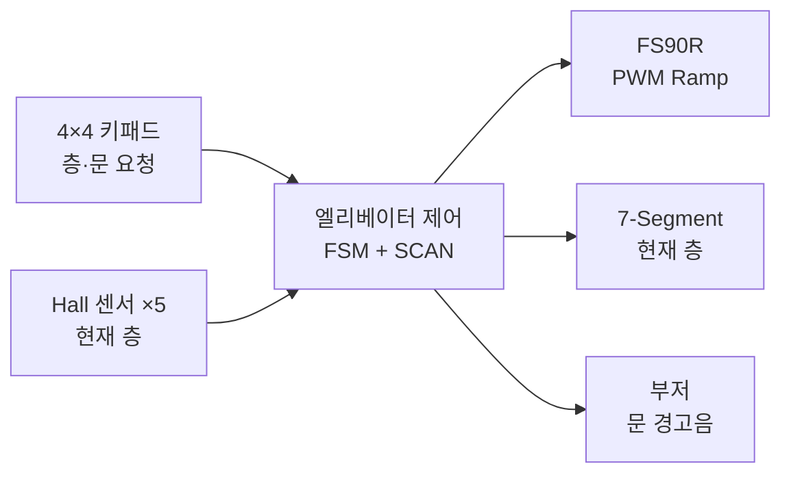
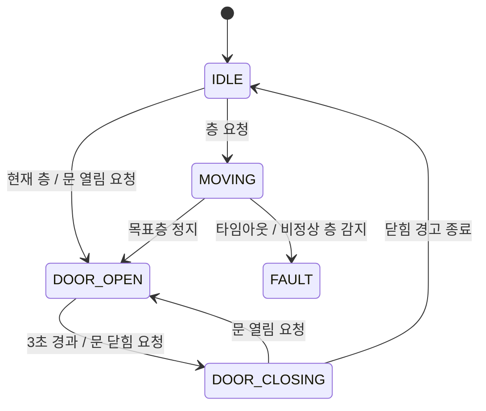

# elevator-control


<p align="center">
  
</p>

STM32G474RET6 기반 5층 엘리베이터 제어 펌웨어이다.

키패드로 층 요청을 입력받고 Hall 센서로 현재 층을 인식한다.
FSM 기반 운행 제어, SCAN 방식 호출 처리, Open-loop PWM Ramp와 타임아웃 기반 안전 제어를 적용했다.

---

## 기능

- 5개 상태로 구성한 엘리베이터 운행 FSM
- 진행 방향을 유지하는 SCAN 방식 층 요청 처리
- Hall 센서 5개를 이용한 층 인식
- 목표층 한 층 전부터 저속으로 전환하는 PWM Ramp
- 이동 중 같은 방향의 가까운 요청 우선 반영
- 문 상태 기반 이동 제한과 자동 닫힘
- 문 열림·닫힘 버튼 및 Non-blocking 경고음
- 층 감지 타임아웃과 비정상 층 감지에 대한 FAULT 처리
- 7-Segment 현재 층 표시

### 구성 요약

| 항목 | 구성 |
| --- | --- |
| 제어 보드 | NUCLEO-G474RE |
| MCU | STM32G474RET6, 170 MHz |
| 구동부 | FS90R 연속회전 서보모터 |
| 위치 인식 | Active-low Hall 센서 5개 |
| 사용자 입력 | 4×4 매트릭스 키패드 |
| 상태 출력 | Common-anode 7-Segment, 경고 부저 |
| 개발 환경 | STM32CubeIDE 1.19.0 / STM32Cube FW_G4 V1.6.3 |

---

## 전체 구조



키패드와 Hall 센서 입력은 엘리베이터 제어 모듈에서 운행 상태와 요청으로 해석한다.
모터, 표시 장치와 부저는 각각의 드라이버 모듈을 통해 제어한다.

---

## 운행 제어

### FSM



| 상태 | 역할 |
| --- | --- |
| `IDLE` | 대기 중인 요청을 확인하고 다음 목표층 선택 |
| `MOVING` | 층 인식, 목표 갱신, 감속과 정지 처리 |
| `DOOR_OPEN` | 이동을 제한하고 문 열림 대기시간 처리 |
| `DOOR_CLOSING` | 닫힘 경고음을 처리한 뒤 대기 상태로 전환 |
| `FAULT` | PWM을 중립값으로 유지하고 추가 이동 제한 |

`Elevator_Update()`는 호출될 때마다 현재 상태에 필요한 처리만 수행하고 반환한다.
문 대기와 경고음은 긴 대기문 없이 `HAL_GetTick()` 기반으로 처리한다.

### SCAN 방식 호출 처리

현재 진행 방향의 가장 가까운 요청을 먼저 처리하고, 해당 방향에 요청이 없을 때 방향을 전환한다.

```text
상승 중 → 현재 층보다 위에 있는 가장 가까운 요청
하강 중 → 현재 층보다 아래에 있는 가장 가까운 요청
진행 방향에 요청 없음 → 방향 전환
```

이동 중 같은 방향의 더 가까운 요청이 들어오면 해당 층을 새로운 목표로 반영한다.
현재 지나가는 층에 요청이 등록되어 있으면 그 층에서 정지해 함께 처리한다.

---

## 층 인식과 모터 제어

### Hall 센서 기반 층 인식

각 층에 배치한 Hall 센서는 Active-low 입력으로 동작한다.
센서가 활성화된 뒤 20 ms 동안 같은 상태가 유지되면 유효한 층 이벤트로 판단한다.

```text
Hall 센서 활성화
↓
20 ms 상태 확인
↓
현재 층 갱신
↓
목표층·감속 지점·이상 이동 판단
```

### Open-loop PWM Ramp

FS90R에는 속도 피드백용 엔코더가 없으므로 Closed-loop PID 대신 Hall 센서 이벤트와 PWM Ramp를 결합한 Open-loop 제어를 사용한다.

| 명령 | PWM Pulse |
| --- | ---: |
| 정지 | 1500 µs |
| 상승 / 저속 상승 | 2100 µs / 1700 µs |
| 하강 / 저속 하강 | 900 µs / 1300 µs |

`Motor_Update()`는 20 ms마다 현재 Pulse를 목표값 방향으로 20 µs씩 변경한다.

- 바로 인접한 층으로 이동할 때는 처음부터 저속으로 출발
- 두 층 이상 이동할 때는 정상 속도로 출발
- 목표층 한 층 전 Hall 이벤트에서 저속으로 전환
- 목표층 감지 후 정지 Pulse로 감속
- PWM 중립 도달을 확인한 뒤 문 열림 상태로 전환

---

## 문 제어와 경고음

문은 운행 FSM의 논리적 상태로 관리하며, 문 상태에서는 모터 이동 명령을 제한한다.

| 입력·상황 | 동작 |
| --- | --- |
| 목표층 도착 | 300 ms 열림 알림음과 3초 대기 |
| `#` | 문 열림 / 열림 대기시간 연장 |
| `*` | 문 닫힘 시작 |
| 문 닫힘 | 100 ms 경고음 3회 |
| 닫히는 중 `#` | 다시 문 열림 상태로 전환 |
| 이동 중 또는 `FAULT` | 문 버튼 입력 무시 |

부저는 PA12의 Active-high GPIO 출력으로 제어한다.
`Buzzer_Update()`가 시간에 따라 출력을 전환하므로 문 대기와 경고음 중에도 메인 루프는 계속 실행된다.

---

## 안전 제어

| 감지 조건 | 처리 |
| --- | --- |
| 이동 중 8초 동안 새 층 이벤트 없음 | `FAULT` 전환 |
| 진행 방향과 반대되는 층 감지 | `FAULT` 전환 |
| 목표층을 지난 층 감지 | `FAULT` 전환 |
| 정상 도착 | PWM 중립 도달 확인 후 문 상태 전환 |
| `DOOR_OPEN` / `DOOR_CLOSING` | 이동 명령 제한 |
| `FAULT` 진입 | PWM Compare를 즉시 중립값으로 설정 |

`FAULT` 상태에서는 중립 PWM을 유지하고 부저 출력을 정지한다.

---

## Hardware

### 주요 부품

| 부품 | 용도 |
| --- | --- |
| NUCLEO-G474RE | 운행 로직과 입출력 제어 |
| FS90R | 엘리베이터 카 구동 |
| Hall 센서 ×5 | 층 위치 인식 |
| 4×4 매트릭스 키패드 | 층 호출과 문 개폐 입력 |
| Common-anode 7-Segment | 현재 층 표시 |
| Active-high 부저 | 문 열림·닫힘 경고 |

### 핀 연결

| 기능 | STM32 핀 | 설정 |
| --- | --- | --- |
| 서보 PWM | PC7 / TIM3_CH2 | 50 Hz PWM |
| Hall 1–5 | PC1, PC0, PA9, PC6, PC10 | Input Pull-up, Active-low |
| 키패드 Row 1–4 | PC5, PC4, PA10, PB3 | GPIO Output |
| 키패드 Column 1–4 | PB5, PB4, PB10, PA8 | Input Pull-up |
| 7-Segment A–DP | PA4, PA0, PB9, PA6, PA7, PA1, PB8, PB6 | GPIO Output, Active-low |
| 경고 부저 | PA12 | GPIO Output, Active-high |

숫자 `1`–`5`는 해당 층을 호출한다.
키패드 배치에 맞춰 `6`–`9`는 1–4층, `0`은 5층 호출로도 사용한다. `#`은 문 열림, `*`은 문 닫힘이며 `A`–`D`는 사용하지 않는다.

---

## Repository

```text
Core/
├─ Inc/
│  ├─ elevator.h
│  ├─ motor.h
│  ├─ hall_sensor.h
│  ├─ keypad.h
│  ├─ display.h
│  └─ buzzer.h
├─ Src/
│  ├─ main.c
│  ├─ elevator.c
│  ├─ motor.c
│  ├─ hall_sensor.c
│  ├─ keypad.c
│  ├─ display.c
│  └─ buzzer.c
└─ Startup/

Drivers/                       STM32 HAL / CMSIS
elevator_control.ioc           STM32CubeMX 설정
.project / .cproject           STM32CubeIDE 프로젝트 설정
STM32G474RETX_FLASH.ld         Flash Linker Script
```

하드웨어 접근과 운행 판단을 분리했다.
`elevator.c`는 GPIO 번호나 PWM Compare 값을 직접 다루지 않고 각 드라이버 모듈의 인터페이스를 사용한다.
